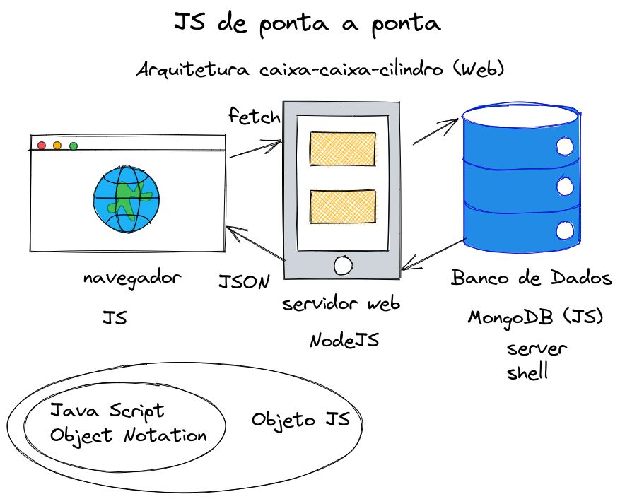

# tarefas-servidor



## Configuração

### Node 

Versão utilizada: 16.13.2

Instalação: https://nodejs.org/en/

Instalação pela linha de comando: https://github.com/nvm-sh/nvm

### MongoDB

Versão utilizada: 5.0.8 Community Edition

Instalação: https://www.mongodb.com/try/download/community

Instalar o Server e o Shell.

## Rodando a aplicação

### Dados no MongoDB

Executar o Mongo Shell:

```sh
mongo
```

Mudar para o db `tarefasDb`

```js
use tarefasDb
```

Inserir alguns documentos na coleção `tarefas` da seguinte forma:

```js
db.tarefas.insertOne({descricao: 'Estudar HTML'});
```

### Subindo o servidor

Instalar dependências:

```sh
npm i
```

Subir o servidor:

```sh
node server
```

Acessar http://localhost:3000
